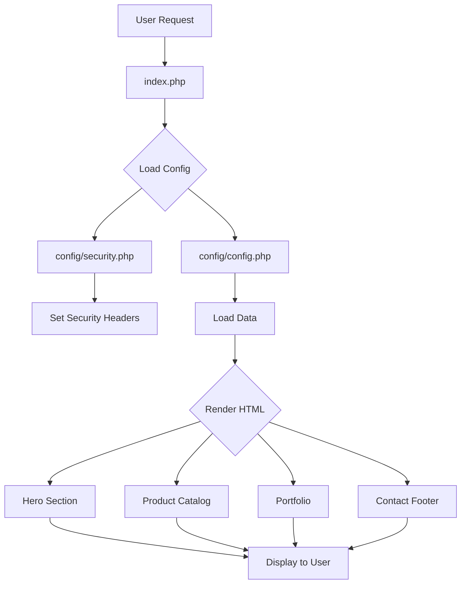

# Kreasi Pro - Website Penyewaan Alat Event


Website profesional untuk layanan penyewaan alat event yang aman, cepat, dan mudah dikembangkan.

## 📋 Daftar Isi

- [Tentang Project](#tentang-project)
- [Fitur Utama](#fitur-utama)
- [Technology Stack](#technology-stack)
- [Struktur Project](#struktur-project)
- [Instalasi & Setup](#instalasi--setup)
- [Konfigurasi](#konfigurasi)
- [Architecture & Flow](#architecture--flow)
- [Security Features](#security-features)
- [Development Guide](#development-guide)
- [Deployment](#deployment)
- [Troubleshooting](#troubleshooting)
- [FAQ](#faq)

---

## 📖 Tentang Project

**Kreasi Pro** adalah website company profile dan katalog layanan untuk bisnis penyewaan peralatan event. Website ini menyediakan informasi lengkap tentang produk, portfolio, dan kontak untuk memudahkan client mendapatkan informasi dan berkomunikasi dengan admin.

### Informasi Project

| Item | Detail |
|------|--------|
| **Nama Project** | Kreasi Pro Official Website |
| **Versi** | 2.0.0 (Security Enhanced) |
| **Tipe** | Company Profile & Catalog |
| **Platform** | Web (Responsive) |
| **Status** | Production Ready |
| **Terakhir Update** | February 2026 |

---

## ✨ Fitur Utama

### 1. **Katalog Produk**
- 8 kategori produk utama (LED Screen, Multimedia, Custom Gate, dll)
- Deskripsi lengkap setiap produk
- Gambar berkualitas tinggi
- Direct WhatsApp integration

### 2. **Portfolio Showcase**
- 6 kategori portfolio (LED Screen, Livestreaming, Backdrop, dll)
- Owl Carousel untuk navigasi smooth
- Lightbox popup untuk preview gambar
- 100+ foto portfolio project

### 3. **Contact & Integration**
- WhatsApp floating button
- Google Maps integration
- Email contact
- Social media links (Instagram, YouTube)

### 4. **Security Features** ⭐ NEW
- XSS Protection (Output encoding)
- Input Validation & Sanitization
- HTTP Security Headers
- CSRF Token Support
- Path Traversal Protection

### 5. **Performance**
- Lazy loading images
- HTTP caching
- GZIP compression
- Optimized asset loading

---

## 🛠 Technology Stack

### Frontend
- **HTML5** - Semantic markup
- **CSS3** - Custom styling + Bootstrap 5
- **JavaScript** - jQuery + Vanilla JS
- **Bootstrap 5.x** - Responsive framework

### Libraries & Plugins
| Library | Versi | Fungsi |
|---------|-------|--------|
| jQuery | 3.6.4 | DOM manipulation |
| Bootstrap | 5.x | UI framework |
| Owl Carousel | 2.x | Image slider |
| Magnific Popup | 1.x | Lightbox |
| WOW.js | 1.x | Scroll animations |
| Font Awesome | 5.15.4 | Icons |
| Bootstrap Icons | 1.4.1 | Additional icons |

### Backend
- **PHP** 8.1+ - Server-side logic
- **Apache** - Web server
- **.htaccess** - URL rewriting & security

### Development Tools
- **Laragon** - Local development environment
- **VS Code** - Code editor (recommended)
- **Git** - Version control

---

## 📁 Struktur Project

```
kreasi-pro-main/
│
├── 📁 assets/                    # Asset media
│   ├── 📁 img/
│   │   ├── 📁 porto/            # Portfolio images
│   │   │   ├── backdrop/
│   │   │   ├── led/
│   │   │   ├── livestreaming/
│   │   │   ├── partisi/
│   │   │   ├── produksi/
│   │   │   └── tv/
│   │   └── 📁 products/         # Product images
│   ├── 📁 logo/
│   ├── slide-1.webp             # Hero carousel
│   ├── slide-2.webp
│   ├── slide-3.webp
│   └── about-us.webp
│
├── 📁 config/                    # ⭐ NEW - Configuration
│   ├── security.php             # Security utilities
│   └── config.php               # App configuration
│
├── 📁 css/                       # Stylesheets
│   ├── bootstrap.min.css
│   └── style.css                # Custom styles
│
├── 📁 js/                        # JavaScript files
│   └── main.js                  # Main JS logic
│
├── 📁 lib/                       # External libraries
│   ├── animate/
│   ├── bootstrap/
│   ├── counterup/
│   ├── easing/
│   ├── lightbox/
│   ├── magnific-popup/
│   ├── owlcarousel/
│   ├── waypoints/
│   ├── wow/
│   └── [other libraries]
│
├── 📁 img/                       # Template images
│   ├── features-1.png
│   ├── sty-1.png
│   └── [other images]
│
├── 📁 scss/                      # SCSS source (optional)
│   └── bootstrap.scss
│
├── .htaccess                    # ⭐ NEW - Security headers
├── index.php                    # ⭐ UPDATED - Main page
├── index.php.backup             # Original backup
└── test_security.php            # ⭐ NEW - Security tests
```

### File Descriptions

#### Core Files

| File | Ukuran | Deskripsi |
|------|--------|-----------|
| `index.php` | 38 KB | Main application file (refactored) |
| `config/security.php` | 11 KB | Security utilities & functions |
| `config/config.php` | 7 KB | Application configuration |
| `.htaccess` | 4 KB | Server configuration & security |

#### Assets

| Folder | Jumlah Files | Deskripsi |
|--------|--------------|-----------|
| `assets/img/porto/` | 100+ | Portfolio project images |
| `assets/img/products/` | 8 | Product catalog images |
| `lib/` | 14 libraries | External dependencies |

---

## 🚀 Instalasi & Setup

### Prerequisites

Pastikan sistem Anda sudah terinstall:

- **PHP** 8.1 atau lebih tinggi
- **Apache** dengan mod_rewrite enabled
- **Web Browser** modern (Chrome, Firefox, Edge)

### Quick Start

#### 1. Download/Clone Project

```bash
# Clone repository
git clone [repository-url] kreasi-pro-main

# Atau extract ZIP file ke folder htdocs/www
```

#### 2. Copy ke Web Server Directory

**Untuk Laragon:**
```bash
# Copy folder ke c:/laragon/www/
c:/laragon/www/kreasi-pro-main/
```

**Untuk XAMPP:**
```bash
# Copy folder ke c:/xampp/htdocs/
c:/xampp/htdocs/kreasi-pro-main/
```

#### 3. Configure Apache (Optional)

Pastikan `mod_rewrite` enabled di Apache:

```apache
# httpd.conf
LoadModule rewrite_module modules/mod_rewrite.so

# AllowOverride harus All
<Directory "C:/laragon/www">
    AllowOverride All
</Directory>
```

#### 4. Start Web Server

**Laragon:**
- Buka Laragon
- Klik "Start All"

**XAMPP:**
- Buka XAMPP Control Panel
- Start Apache

#### 5. Akses Website

Buka browser dan akses:
```
http://localhost/kreasi-pro-main/
```

### Verifikasi Instalasi

Checklist untuk memastikan instalasi berhasil:

- [ ] Website loading tanpa error 404
- [ ] Semua gambar tampil
- [ ] Navigation menu berfungsi
- [ ] Product cards tampil lengkap
- [ ] Portfolio carousel berjalan
- [ ] WhatsApp button muncul
- [ ] Tidak ada error di browser console

---

## ⚙️ Konfigurasi

### 1. Konfigurasi Kontak

Edit file `config/config.php`:

```php
// Contact Information
define('WHATSAPP_NUMBER', '6282298074293');  // ← Ubah nomor WhatsApp
define('EMAIL_ADDRESS', 'info@kreasiproofficial.com');  // ← Ubah email
define('PHYSICAL_ADDRESS', 'Jl. Musyawarah No.84, ...');  // ← Ubah alamat
```

### 2. Konfigurasi Social Media

Update array social media:

```php
// Social Media Links
$socialMedia = [
    "instagram" => "https://www.instagram.com/kreasipro.id",  // ← Ubah
    "youtube" => "https://www.youtube.com/@kreasiproofficial",  // ← Ubah
];
```

### 3. Update Products

Tambah/edit produk di `config/config.php`:

```php
$products = [
    [
        "name" => "Nama Produk Baru",
        "description" => "Deskripsi produk...",
        "image" => "assets/img/products/nama-file.webp",
    ],
    // ... produk lainnya
];
```

**PENTING:** Upload gambar produk ke folder `assets/img/products/`

### 4. Update Portfolio

Edit captions portfolio:

```php
$captions = [
    'led' => [
        'ledartboard-1.webp' => 'Caption Event 1',  // ← Edit caption
        'ledartboard-2.webp' => 'Caption Event 2',
        // ... tambahkan lebih banyak
    ],
    // ... kategori lainnya
];
```

**Upload gambar portfolio ke:**
```
assets/img/porto/[kategori]/[nama-file].webp
```

Kategori yang tersedia:
- `backdrop/` - Custom backdrop & photobooth
- `led/` - LED Screen & Videotron
- `livestreaming/` - Multimedia & livestreaming
- `partisi/` - Booth & Partisi R8
- `produksi/` - Event production
- `tv/` - TV Plasma & Digital Signage

### 5. Google Maps Integration

Update iframe Google Maps di `index.php` (line ~879):

```html
<iframe src="https://www.google.com/maps/embed?pb=..." 
        width="100%" 
        height="450">
</iframe>
```

**Cara mendapatkan embed code:**
1. Buka Google Maps
2. Cari lokasi bisnis Anda
3. Klik "Share" → "Embed a map"
4. Copy iframe code
5. Paste di `index.php`

---

## 🏗 Architecture & Flow

### Application Flow



### Request Lifecycle

1. **Browser Request** → `http://localhost/kreasi-pro-main/`
2. **Apache** menerima request
3. **.htaccess** memproses security rules
4. **index.php** di-execute:
   - Define constants
   - Load `config/security.php`
   - Set security headers
   - Load `config/config.php`
   - Generate base URL
5. **HTML Rendering**:
   - Header & Navigation
   - Hero carousel
   - Product sections
   - Portfolio galleries
   - Contact & Footer
6. **JavaScript Execution**:
   - Initialize WOW animations
   - Setup Owl Carousel
   - Magnific Popup
   - Scroll behaviors
7. **Response** dikirim ke browser

### Data Flow

```
Products Array → renderProductCard() → HTML Cards → Browser
Portfolio Files → glob() → sanitize → Owl Carousel → Browser
Contact Info → escapeHtml() → Footer → Browser
```

---

## 🔐 Security Features

### 1. Output Encoding

**Semua output di-escape untuk mencegah XSS:**

```php
// HTML Content
<?= escapeHtml($product['name']); ?>

// HTML Attributes
">

// URLs
<a href="<?= escapeUrl($link); ?>">

// JavaScript
<script>var data = '<?= escapeJs($data); ?>';</script>
```

### 2. Input Validation

**Server variables divalidasi:**

```php
// Validate HTTP_HOST
$host = validateHost($_SERVER['HTTP_HOST']);

// Sanitize file paths
$folder = sanitizeFilename($_GET['folder']);
```

### 3. Security Headers

**.htaccess menambahkan headers:**

```apache
X-Frame-Options: SAMEORIGIN           # Anti-clickjacking
X-Content-Type-Options: nosniff       # Anti-MIME sniffing
X-XSS-Protection: 1; mode=block       # XSS filter
Referrer-Policy: strict-origin        # Referrer control
```

### 4. CSRF Protection

**Token generation (untuk form):**

```php
// Generate token
$token = generateCsrfToken();

// Validate submission
if (validateCsrfToken($_POST['csrf_token'])) {
    // Process form
}
```

### 5. File Access Restrictions

**.htaccess melindungi files sensitif:**

```apache
# Block access to config files
<FilesMatch "^(config\.php|security\.php)$">
    Order allow,deny
    Deny from all
</FilesMatch>
```

---

## 💻 Development Guide

### Setup Development Environment

#### 1. Install Laragon

Download dari: https://laragon.org/download/

**Recommended Settings:**
- PHP 8.1+
- Apache 2.4+
- Enable `mod_rewrite`

#### 2. Code Editor

**VS Code Extensions (Recommended):**
- PHP Intelephense
- HTML CSS Support
- JavaScript (ES6) code snippets
- Prettier - Code formatter
- Live Server

#### 3. Browser DevTools

**Chrome DevTools Shortcuts:**
- `F12` - Open DevTools
- `Ctrl+Shift+C` - Inspect element
- `Ctrl+Shift+J` - Console
- `Ctrl+Shift+I` - Network tab

### Development Workflow

#### Menambah Produk Baru

**1. Prepare Image:**
```bash
# Upload ke assets/img/products/
# Format: nama-produk.webp
# Recommended size: 800x600px
```

**2. Edit config/config.php:**
```php
$products[] = [
    "name" => "Nama Produk",
    "description" => "Deskripsi lengkap...",
    "image" => "assets/img/products/nama-produk.webp",
];
```

**3. Test:**
- Reload website
- Verify product card muncul di section Layanan
- Check dropdown navigation updated
- Test WhatsApp button

#### Menambah Portfolio

**1. Upload Images:**
```bash
# Upload ke kategori yang sesuai
assets/img/porto/led/project-name.webp
```

**2. Add Caption:**
```php
$captions = [
    'led' => [
        'project-name.webp' => 'Event Name 2026',
    ],
];
```

**3. Test Carousel:**
- Scroll ke Portfolio section
- Verify gambar muncul di carousel
- Test navigation arrows
- Check popup lightbox

### Debugging

#### PHP Errors

**Enable error reporting (development only):**

```php
// TOP of index.php (development only)
error_reporting(E_ALL);
ini_set('display_errors', '1');
```

**Check PHP error log:**
```bash
# Laragon
c:/laragon/logs/apache_error.log
```

#### JavaScript Errors

**Browser Console:**
```javascript
// Check for errors
console.error();

// Debug variables
console.log($products);
```

#### Common Issues

| Issue | Solution |
|-------|----------|
| Images not loading | Check file path & permissions |
| Carousel not working | Verify jQuery loaded first |
| Popup not opening | Check Magnific Popup script |
| Styles broken | Clear browser cache |

### Testing

#### Security Testing

```bash
# Run security tests
php test_security.php
```

#### PHP Syntax Check

```bash
# Check syntax
php -l index.php
php -l config/security.php
```

#### Browser Testing

Test di berbagai browser:
- Chrome (latest)
- Firefox (latest)
- Edge (latest)
- Safari (iOS/macOS)

#### Responsive Testing

Test di berbagai device sizes:
- Mobile (320px - 480px)
- Tablet (768px - 1024px)
- Desktop (1200px+)

---

## 📦 Deployment

### Pre-Deployment Checklist

- [ ] Test semua fitur di local
- [ ] Update contact information
- [ ] Optimize images (compression)
- [ ] Backup database (jika ada)
- [ ] Remove test files
- [ ] Disable error display
- [ ] Enable HTTPS (recommended)

### Deployment ke Hosting

#### 1. Prepare Files

```bash
# Remove development files
rm test_security.php
rm index copy.php
rm index.php.backup (optional)

# ZIP project
zip -r kreasi-pro.zip kreasi-pro-main/
```

#### 2. Upload via FTP/cPanel

**FTP Upload:**
```
Host: ftp.yourdomain.com
Username: your@username
Password: ********
Directory: /public_html/
```

**cPanel File Manager:**
1. Login cPanel
2. File Manager
3. Upload ZIP
4. Extract

#### 3. Configure .htaccess

**Update base path jika perlu:**

```apache
RewriteBase /
```

#### 4. Set File Permissions

```bash
# Folders: 755
chmod 755 assets/
chmod 755 config/

# PHP Files: 644
chmod 644 index.php
chmod 644 config/*.php

# .htaccess: 644
chmod 644 .htaccess
```

#### 5. Enable HTTPS (Recommended)

**1. Install SSL Certificate:**
- cPanel → SSL/TLS → Install Certificate
- Or use Let's Encrypt (free)

**2. Force HTTPS in .htaccess:**

```apache
# Redirect HTTP to HTTPS
RewriteCond %{HTTPS} off
RewriteRule ^(.*)$ https://%{HTTP_HOST}/$1 [R=301,L]
```

**3. Enable HSTS:**

Uncomment di `.htaccess`:
```apache
Header always set Strict-Transport-Security "max-age=31536000; includeSubDomains; preload"
```

### Post-Deployment

- [ ] Verify website accessible
- [ ] Test all links & buttons
- [ ] Check SSL certificate
- [ ] Test WhatsApp integration
- [ ] Verify Google Maps
- [ ] Check mobile responsiveness
- [ ] Test contact forms
- [ ] Monitor error logs

---

## 🔧 Troubleshooting

### Common Issues & Solutions

#### 1. Website Tidak Bisa Diakses

**Symptom:** 404 Not Found

**Solutions:**
```bash
# Check file exists
ls index.php

# Check Apache running
# Laragon: Check "Start All" button
# XAMPP: Start Apache service

# Check .htaccess
cat .htaccess
```

#### 2. Images Tidak Muncul

**Symptom:** Broken image icons

**Solutions:**
```bash
# Check file path
ls assets/img/products/

# Check permissions
chmod 755 assets/
chmod 644 assets/img/**/*.webp

# Check browser console for 404 errors
```

#### 3. Portfolio Carousel Tidak Jalan

**Symptom:** Images stacked, no navigation

**Solutions:**
```html
<!-- Verify jQuery loaded -->
<script src="lib/jquery.min.js"></script>

<!-- Verify Owl Carousel CSS -->
<link href="lib/owlcarousel/assets/owl.carousel.min.css">

<!-- Verify Owl Carousel JS -->
<script src="lib/owlcarousel/owl.carousel.min.js"></script>

<!-- Check browser console for errors -->
```

#### 4. PHP Errors

**Symptom:** 500 Internal Server Error

**Solutions:**
```bash
# Check error log
tail -f c:/laragon/logs/apache_error.log

# Check PHP syntax
php -l index.php

# Verify PHP version
php -v  # Should be 8.1+
```

#### 5. Security Headers Tidak Aktif

**Symptom:** Headers missing in browser DevTools

**Solutions:**
```bash
# Check mod_headers enabled
# Apache config: LoadModule headers_module

# Check .htaccess syntax
# <IfModule mod_headers.c> sections

# Restart Apache
```

#### 6. WhatsApp Button Tidak Berfungsi

**Symptom:** Button tidak redirect ke WhatsApp

**Solutions:**
```php
// Verify nomor WhatsApp
define('WHATSAPP_NUMBER', '6282298074293');  // Must start with country code

// Check URL encoding
$whatsappText = urlencode("Message text");

// Test link manually
https://api.whatsapp.com/send?phone=6282298074293&text=Test
```

---

## ❓ FAQ

### General Questions

**Q: Apakah project ini sudah production-ready?**  
A: Ya, versi 2.0.0 sudah enhanced dengan security features dan siap untuk production.

**Q: Apakah perlu database?**  
A: Tidak. Website ini static-based dengan data hardcoded di config. Cocok untuk website company profile sederhana.

**Q: Bagaimana cara backup website?**  
A: Simply ZIP entire folder `kreasi-pro-main/`. Tidak ada database yang perlu di-backup.

**Q: Apakah responsive untuk mobile?**  
A: Ya, menggunakan Bootstrap 5 yang fully responsive.

### Technical Questions

**Q: Berapa minimum PHP version?**  
A: PHP 8.1 atau lebih tinggi required untuk security features.

**Q: Apakah bisa running di shared hosting?**  
A: Ya, asalkan hosting support PHP 8.1+ dan mod_rewrite.

**Q: Apakah support multi-language?**  
A: Belum. Saat ini hanya Bahasa Indonesia. Bisa dikembangkan dengan i18n library.

**Q: Bagaimana cara menambah form kontak?**  
A: Perlu development tambahan untuk handling form submission. Recommended menggunakan PHPMailer atau API external.

### Security Questions

**Q: Apakah website ini aman?**  
A: Ya, sudah implement best practices:
- XSS Protection
- Input Validation
- Security Headers
- CSRF Protection ready

**Q: Apakah perlu update security?**  
A: Monitor PHP security updates dan update dependencies secara berkala.

**Q: Bagaimana cara enable HTTPS?**  
A: Install SSL certificate di hosting dan uncomment HSTS header di `.htaccess`.

---

## 📞 Support & Contact

Untuk pertanyaan development atau issue:

1. **Check Documentation** - Baca dokumentasi ini terlebih dahulu
2. **Review Code** - Lihat comments di code untuk penjelasan
3. **Test Security** - Run `test_security.php` untuk verify integrity
4. **Contact Developer** - Hubungi developer yang maintain project ini

---

## 📄 License

**Proprietary License**

© 2026 Kreasi Pro. All rights reserved.

Website ini adalah properti eksklusif Kreasi Pro. Unauthorized copying, distribution, or modification is prohibited.

---

## 🔄 Version History

### Version 2.0.0 (Current) - Feb 2026
**Security Enhanced Release**
- ✅ Added comprehensive security features
- ✅ Refactored code structure
- ✅ Added config files separation
- ✅ Implemented output encoding
- ✅ Added security headers
- ✅ Created test suite
- ✅ Full documentation

### Version 1.0.0 - Original Release
- Initial website launch
- Basic catalog & portfolio
- WhatsApp integration
- Google Maps integration

---

## 🙏 Acknowledgments

**Libraries & Frameworks:**
- Bootstrap Team
- jQuery Foundation
- Owl Carousel
- Magnific Popup
- Font Awesome
- WOW.js

**Development Tools:**
- Laragon
- Visual Studio Code
- Google Fonts

---

**Last Updated:** February 14, 2026  
**Maintained By:** Development Team  
**Version:** 2.0.0 (Security Enhanced)
